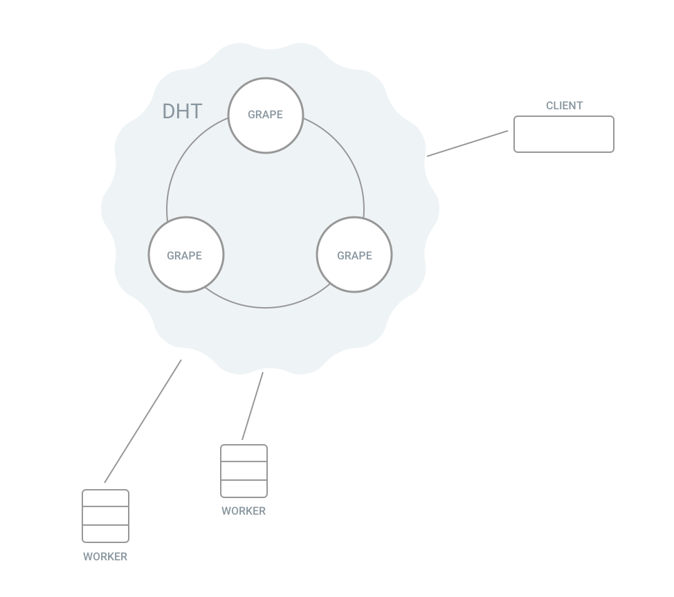
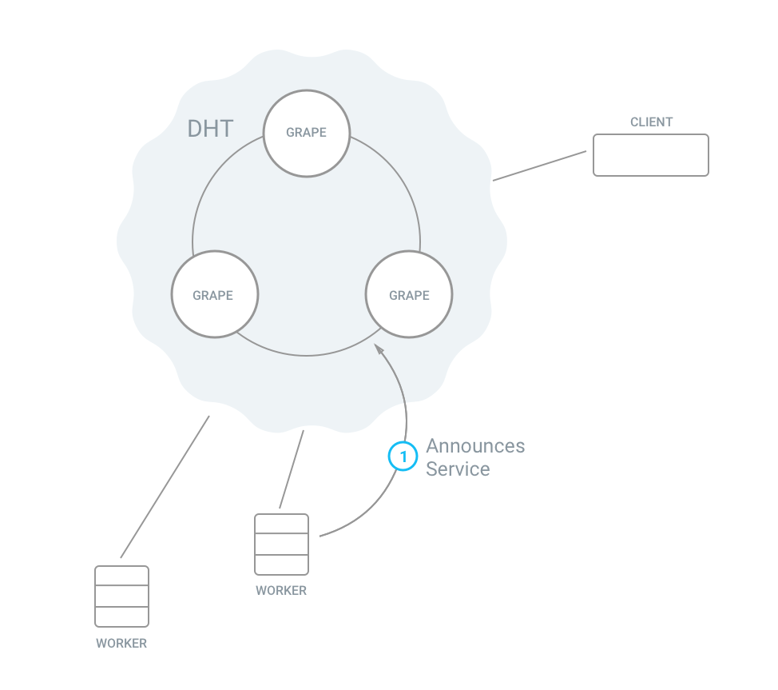
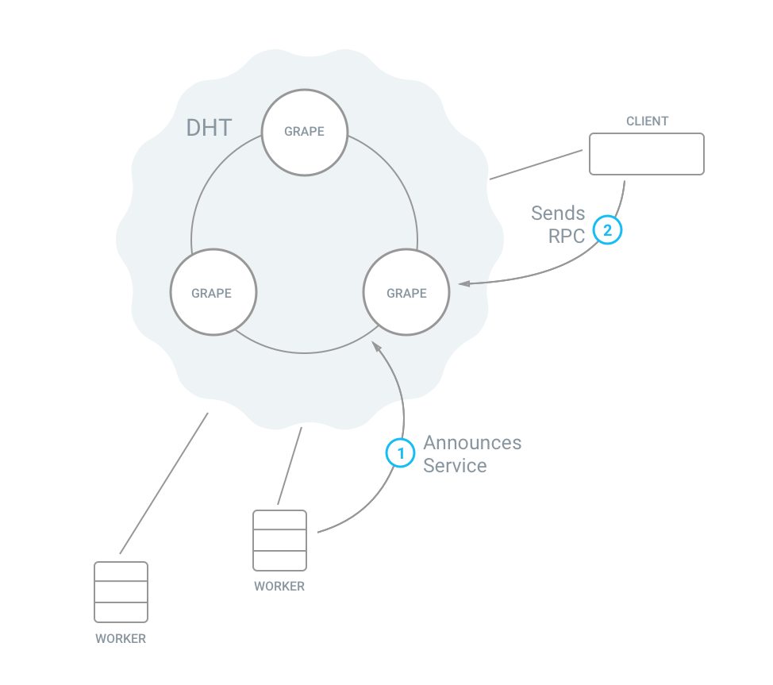
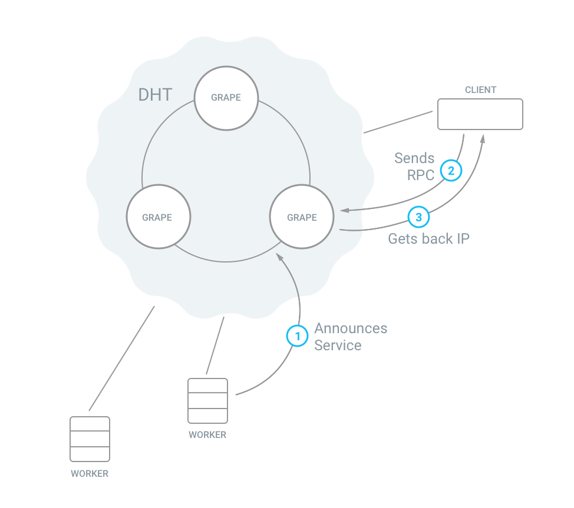

Grenache is a DHT based high-performance microservices framework by Bitfinex.
It's decentralised and optimized for performance. Because it's simple, it's easy
to understand and to set up.

Grenache uses Distributed Hashtables, known from Bittorrent, to build a network between peers.
It's based on [Kademlia](https://en.wikipedia.org/wiki/Kademlia).

Peers can send each other commands (RPC), and they can also store values in the DHT.
Pub/Sub is also possible.

The [Grenache Ecosystem](#implementations) supports Ruby and Node.js. There are multiple transports available: HTTP (plain & TLS), Websocket (plain & TLS), ZeroMQ.

## Contents

 - [Features](#features)
 - [Implementations](#implementations)
 - [Grape Network Composition](#grape-network-composition)
 - [Grenache in Action: a RPC example](#grenache-in-action-a-rpc-example)
 - [Articles](#articles)
 - [Background](#background)
 - [Contribute](#contribute)
 - [Contacts](#contacts)

## Features

* Decentralised / Distributed architecture
* Easy Bootstrap
* Indefinite scalability and shapes
* High-Performance

## Implementations

### Grape (the core)

* https://github.com/bitfinexcom/grenache-grape

### Peer Implementations

Transports:
* WebSocket transport: super-fast, great for Internet
* HTTP transport: great for Internet
* ZeroMQ transport: super-fast, perfect for internal networks

Patterns:
* PUT/GET: put/get data to/from the DHT
* RPC: simple and efficient RPC pattern
* PUB/SUB: (Work In Progress)

Note: At the moment there is no interoperability between WebSocket and ZeroMQ implementations. A Proxy implementation will come later.

#### Node.JS Clients
* https://github.com/bitfinexcom/grenache-nodejs-ws: WebSocket based Grape microservices
* https://github.com/bitfinexcom/grenache-nodejs-http: HTTP based Grape microservices
* https://github.com/bitfinexcom/grenache-nodejs-zmq: ZeroMQ based Grape microservices
* https://github.com/bitfinexcom/grenache-nodejs-ws-tls: WebSocket based Grape microservices with TLS support
* https://github.com/bitfinexcom/grenache-nodejs-link: HTTP based connections to the DHT

#### Ruby Clients
* https://github.com/bitfinexcom/grenache-ruby-ws: WebSocket based Grape microservices
* https://github.com/bitfinexcom/grenache-ruby-http: HTTP based Grape microservices

#### CLI Clients
* https://github.com/bitfinexcom/grenache-cli: Command Line Interface for Grape microservices

## Grape Network Composition

### 1. The Grape: Grenache Discovery Node

Grenache-Grape builds the Grenache Network. It offers multiple DHT interaction APIs for Clients: service discovery and DHT data storage.

**Features**

* Announce a Service
* Lookup a Service
* Push data to DHT

### 2. Clients: Grenache Client implementations on specific Transports

Grenache supports WebSocket, HTTP (plain / TLS) and ZeroMQ as transport protocols.

**Features**

* Offer / Publish a Service: create and announce a service on the DHT
* Request / Subscribe to Service: find a service throught the DHT and connect to it
* Store and retrieve data in the DHT

## Grenache in Action: a RPC example

Within a Grenache network, connected peers can interact in different ways with each other.
They can store and retrieve data in the DHT. They can also work in a Pub/Sub pattern. Or they can work in RPC mode, with different workers and clients.

In the diagram above we see three Grape nodes forming the DHT network. We have two workers connected. There is also another peer which will act as client.

Our workers announce their service to the DHT:

Now peers can make use of the service and send commands to a service. They send their remote command to the DHT.

The DHT looks up any peers that announce the service. In our case the two workers. The client receives the IP of the two workers.

Finally the client connects to both workers, who are executing the command and send back the result to the client.

## Articles

 * http://blog.bitfinex.com/tutorial/bitfinex-loves-microservices-grenache/
 * https://medium.com/bitfinex/introducing-svc-js-a-framework-for-grenache-7119f2d7769e
 * http://blog.bitfinex.com/tutorial/grenache-cli-command-line-interface/

## Background

* [Distributed Hash Table](http://www.bittorrent.org/beps/bep_0005.html) introduction
* [Kademlia on Wikipedia](https://en.wikipedia.org/wiki/Kademlia)
* [Kademlia: A Peer-to-Peer Information System Based on the XOR Metric](http://www.ic.unicamp.br/~bit/ensino/mo809_1s13/papers/P2P/Kademlia-%20A%20Peer-to-Peer%20Information%20System%20Based%20on%20the%20XOR%20Metric%20.pdf)

## Contribute

Any contribution in form of question, issue, idea and pull requests is well accepted

## Contacts
* [Paolo Ardoino](https://github.com/prdn)
